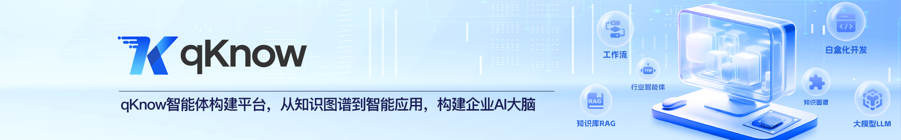

 
 
 
 
 
 
 

  <a href="README.md">📖简体中文</a> | 📖English

## 🌈 Platform Overview

**qKnow** is an open-source AI agent building platform designed for enterprise **knowledge intelligence** and **industry-specific AI applications**. Centered around core capabilities such as **knowledge graphs**, **knowledge base RAG**, **Bot building**, and **ready-to-use AI applications**, qKnow supports unified access to enterprise documents, structured data, business knowledge, and expert experience, as well as intelligent knowledge accumulation. It helps enterprises quickly implement knowledge extraction, knowledge modeling, intelligent Q&A, Bot building, and AI application deployment. qKnow can serve as an open-source foundation for building enterprise knowledge hubs, intelligent Q&A platforms, agent development platforms, and industry-specific deep AI solutions. It is also well suited for developers to perform secondary development and scenario-based extensions.

✨✨✨**Online Documentation**✨✨✨ <a href="https://community.qknow.ai" target="_blank">https://community.qknow.ai</a>

✨✨✨**Open Source Edition Demo**✨✨✨ <a href="https://demo.qknow.ai" target="_blank">https://demo.qknow.ai</a>，Account: qKnow Password: qKnow123

✨✨✨**Professional Edition Demo**✨✨✨ <a href="https://pro-demo.qknow.ai" target="_blank">https://pro-demo.qknow.ai</a>，Please [contact customer service](https://qknow.qiantong.tech/business.html) to obtain a demo account.

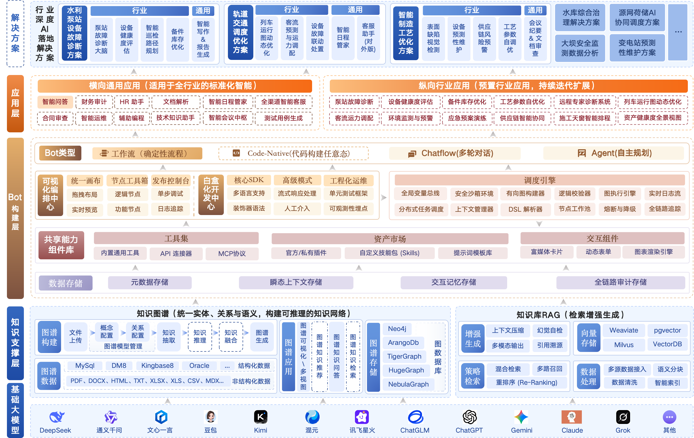

> If qKnow is helpful to you, please give us a **Star ⭐️**. It is the greatest motivation for us to keep improving! 🚀

## 🎯 What scenarios can qKnow help you solve?

You can use qKnow to quickly build:

- Enterprise knowledge base Q&A assistants
- Industry expert agents
- Internal policy / standard / manual Q&A systems
- Explainable intelligent retrieval applications driven by knowledge graphs
- AI Bots and intelligent applications for business workflows
- Knowledge hubs and intelligent analysis platforms for industry scenarios

## ✨ Why choose qKnow?

| Capability Highlight | Description |
|-------------------|----------------------------------------------------------|
| 🧠 Knowledge Graph + RAG Dual Engine | Supports both structured knowledge modeling and unstructured document retrieval, balancing semantic recall, relational reasoning, and result traceability. |
| 🤖 Enterprise-oriented Agent Building | Supports Bot creation, debugging, publishing, and application configuration to help enterprises quickly build practical business agents. |
| 🧩 Visual Orchestration | Orchestrates Workflow, Chatflow, and Agent through a drag-and-drop canvas, lowering the barrier to building complex AI applications. |
| 📚 Enterprise Knowledge Asset Accumulation | Supports unified management of knowledge assets such as documents, structured data, concepts, relations, entities, and triples. |
| 🔌 Open Model Integration | Integrates large model capabilities based on Spring AI, making it easy to adapt to different model services and internal enterprise model environments. |
| 🏗️ Pluggable Application Extension | Based on a unified application plugin architecture, supports knowledge Q&A and the continuous integration of more intelligent applications in the future. |
| ☕ Java Technology Stack Friendly | The backend uses JDK 17 + Spring Boot 3, making it suitable for Java teams to perform secondary development, private deployment, and enterprise integration. |

## 🍱 Typical Application Scenarios

| Scenario | Description |
|-------------------|--------------------------------------|
| **Enterprise Agent Building** | Quickly build business Bots such as knowledge Q&A, process automation, expert assistants, and intelligent customer service. |
| **Enterprise Knowledge Intelligence Governance** | Unify documents, databases, business systems, and expert experience into reusable knowledge assets. |
| **Knowledge Graph Enhanced Applications** | Build explainable and traceable business knowledge networks based on entities, relations, events, and rules. |
| **Knowledge Base RAG Q&A and Retrieval** | Provide accurate retrieval, retrieval-augmented generation, and citation traceability for policies, standards, manuals, reports, cases, and other materials. |
| **Enterprise Deep AI Application Extension** | Starting from the built-in intelligent Q&A application, support the continuous integration of future intelligent applications based on a unified plugin architecture. |

## 🚀 Core Advantages

- **Knowledge-driven agent building**: Enable agents to better understand enterprise knowledge and business context through knowledge graphs and knowledge base RAG.
- **Visual orchestration and building**: Support Workflow, Chatflow, and Agent orchestration through a drag-and-drop canvas, lowering the barrier to agent building.
- **Integrated Bot building and application configuration**: Form a complete usage workflow from agent creation, debugging, and publishing to application configuration.
- **Open and compatible large model foundation**: Integrate large model capabilities based on Spring AI, supporting flexible adaptation to different model services.
- **Continuous pluggable application extension**: Based on a unified application plugin development architecture, support future intelligent applications to be integrated into the platform in a standardized way.

## ✨ Core Features
| Feature Module | Description |
|---------|-----------------------------------------------------|
| Model Integration | Supports unified configuration and management of large model services, and integrates different model vendors based on Spring AI to provide model capabilities for agents and applications. |
| Bot Management | Supports the creation, editing, copying, publishing, debugging, and runtime status management of agents. |
| Visual Orchestration Center | Supports Workflow, Chatflow, and Agent orchestration through a drag-and-drop canvas to quickly build business agents. |
| Asset Center | Supports unified management of tools, plugins, prompts, knowledge components, and reusable agent assets. |
| Application Center | Supports centralized display, access, and management of platform built-in applications and user-created applications. |
| Application Configuration | Supports binding applications with knowledge bases, knowledge graphs, Bots, and parameter configurations to generate dedicated applications. |
| Knowledge Q&A | Based on a unified application plugin development architecture, supports knowledge Q&A and future intelligent applications to be integrated in a pluggable way with standardized access, independent extension, and unified management. |
| Knowledge Center | Supports categorized management of documents, materials, and knowledge assets, helping users uniformly accumulate and organize enterprise knowledge. |
| Concept Configuration | Supports custom entities, concepts, and extraction rules, providing a standardized concept system for knowledge graph construction. |
| Relation Configuration | Supports configuring relation types and extraction rules between concepts, enhancing the ability to model associations between knowledge. |
| Unstructured Extraction | Supports automatic extraction of entities, relations, and triples from unstructured content such as documents and text. |
| Structured Extraction | Supports extracting knowledge elements from structured data sources such as databases and tables and building graph data. |
| Graph Visualization | Supports visual browsing of knowledge graphs, relation tracing, intelligent retrieval, and interactive analysis. |
| Knowledge Base Management | Supports knowledge base creation, configuration, update, and management, providing knowledge support for RAG Q&A and semantic retrieval. |
| File Parsing | Supports multi-format file parsing, text cleaning, content chunking, and semantic segment generation. |
| Recall Testing | Supports simulating user questions to test the recall effect of knowledge segments and assists in optimizing retrieval parameters. |

> Note: Core features will continue to evolve with future versions. More intelligent applications, industry plugins, and knowledge enhancement capabilities will be gradually integrated based on the unified plugin architecture. Community participation and co-building are welcome.

## 🛠️ Technology Stack

qKnow adopts a front-end and back-end separation architecture. The backend is based on Spring Boot 3 and JDK 17, the frontend is based on Vue 3, and large model capabilities are integrated through Spring AI.

<table>
  <tr>
    <th>Technology Stack</th><th>Framework</th><th>Description</th>
  </tr>
  <tr>
    <td rowspan="8">Backend Technology Stack</td><td>JDK 17</td><td>Backend runtime environment</td>
  </tr>
  <tr>
    <td>Spring Boot 3</td><td>Main backend framework, simplifying configuration and development</td>
  </tr>
  <tr>
    <td>Spring AI</td><td>Framework for large model integration and AI capability integration</td>
  </tr>
  <tr>   
    <td>MyBatis-Plus</td><td>ORM framework that simplifies database operations</td>
  </tr>
  <tr>
    <td>Spring Framework</td><td>Infrastructure support, including dependency injection, aspect-oriented programming, and other capabilities</td>
  </tr>
  <tr>
    <td>Quartz</td><td>Scheduled task scheduling</td>
  </tr>
  <tr>
    <td>Spring Security</td><td>Authentication, authorization, and security control</td>
  </tr>
  <tr>
    <td>Alibaba Druid</td><td>Database connection pool that optimizes database access performance</td>
  </tr>

  <tr>
    <td rowspan="8">Frontend Technology Stack</td><td>Vue 3</td><td>Progressive frontend framework</td>
  </tr>
  <tr>
    <td>Vite</td><td>Fast build tool</td>
  </tr>
  <tr>
    <td>Element Plus</td><td>UI component library</td>
  </tr>
  <tr>
    <td>Axios</td><td>HTTP request library</td>
  </tr>
  <tr>
    <td>Pinia</td><td>Frontend state management</td>
  </tr>
  <tr>
    <td>Vue Router</td><td>Frontend routing control</td>
  </tr>
  <tr>
    <td>Vis</td><td>Knowledge graph display and network graph visualization</td>
  </tr>
  <tr>
    <td>ECharts</td><td>Data visualization library supporting various chart displays</td>
  </tr>

  <tr>
    <td rowspan="6">Third-party Dependencies</td><td>MySQL 5.7</td><td>Relational database</td>
  </tr>
  <tr>
    <td>Neo4j 4.4.40</td><td>Graph database for knowledge graph storage and query</td>
  </tr>
  <tr>
    <td>Weaviate</td><td>Vector database for knowledge base vector storage and semantic retrieval</td>
  </tr>
  <tr>
    <td>Redis</td><td>Cache and high-performance data reading</td>
  </tr>
  <tr>
    <td>Swagger / OpenAPI</td><td>API documentation generation and debugging tools</td>
  </tr>
  <tr>
    <td>Docker (optional)</td><td>Containerized deployment support</td>
  </tr>
</table>

## 🏗️ Deployment Requirements
Before deploying qKnow, make sure the following environments and tools have been properly installed:

<table>
  <tr>
    <th>Environment</th><th>Item</th><th>Recommended Version</th><th>Description</th>
  </tr>
  <tr>
    <td rowspan="7">Backend</td><td>JDK</td><td>17+</td><td>OpenJDK 17 is recommended</td>
  </tr>
  <tr>
    <td>Maven</td><td>3.8+</td><td>Project build and dependency management</td>
  </tr>
  <tr>
    <td>MySQL</td><td>5.7</td><td>Relational database</td>
  </tr>
  <tr>
    <td>Neo4j</td><td>4.4.40</td><td>Graph database</td>
  </tr>
  <tr>
    <td>Weaviate</td><td>Stable version recommended</td><td>Vector database</td>
  </tr>
  <tr>
    <td>Redis</td><td>5.0+</td><td>Cache and messaging support</td>
  </tr>
  <tr>
    <td>Operating System</td><td>Windows / Linux / Mac</td><td>Can run in common environments</td>
  </tr>

  <tr>
    <td rowspan="3">Frontend</td><td>Node.js</td><td>16+</td><td>Build tool dependency</td>
  </tr>
  <tr>
    <td>npm / pnpm / yarn</td><td>Any one of them</td><td>Package manager</td>
  </tr>
  <tr>
    <td>Vue 3 / Vite</td><td>3.x / latest stable version</td><td>Frontend development and build tools</td>
  </tr>
</table>

## 🚨 Commercial Licensing

qKnow provides two editions: **Professional Edition** and **Open Source Edition**, meeting the needs of users in different scales and scenarios. The two editions each have their own strengths and complement each other: the Open Source Edition is more like an introductory mentor, helping users get started at low cost; the Professional Edition is more like an expert consultant, providing greater depth and assurance. No matter which edition you choose, qKnow will become a reliable partner, helping enterprises move toward intelligent agent building and AI-integrated applications.

👉 For **Open Source Edition brand customization licensing** or **Professional Edition consultation**, please click the button for details: [💼 Learn More About Licensing](https://qknow.qiantong.tech/business.html)

## 🚀 Quick Start

| Deployment Method | Description | Applicable Scenarios |
|---------------------------------------------------------------------------------------------|--------------------------------------------------------------------------|------------------------|
| [Docker Compose Deployment](https://qknow.qiantong.tech/docs/deploy/docker-compose-deployment.html) | All components (DeepKE, Neo4j, MySQL, Nginx, Redis, etc.) and the qKnow source code are started with Docker Compose in one step | **Quick start for beginners**, feature demos, test environments |
| [Self-managed Deployment (Manual Installation)](https://qknow.qiantong.tech/docs/deploy/manual-deployment/) | All dependent components and qKnow services need to be manually installed and configured | **Production environments**, large-scale deployment, personalized customization scenarios |

> For your first experience, Docker Compose deployment is recommended because it helps you complete environment startup and feature verification more quickly.

## 👥 Communication and Feedback

You are welcome to join the official qKnow QQ group to get the latest platform updates, deployment support, and community communication.

👉 [Click to Join the QQ Group](https://qknow.qiantong.tech/discuss.html)

You can also report issues, submit suggestions, or participate in project co-building through Issues.

## 🤝 Contributing

qKnow welcomes developers, enterprise users, and industry partners to participate in co-building.

You can participate in the following ways:

- Submit Issues to report problems or propose suggestions
- Submit Pull Requests to contribute code
- Improve documentation, examples, and deployment tutorials
- Share industry application practices based on qKnow
- Participate in co-building knowledge graphs, RAG, Agent, plugin ecosystems, and other areas

## 🖼️ System Screenshots
<table>
    <tr>
        <td>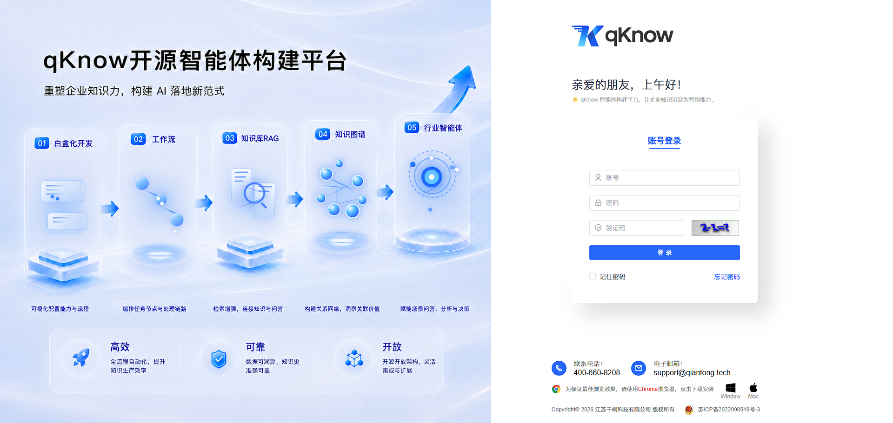</td>
        <td>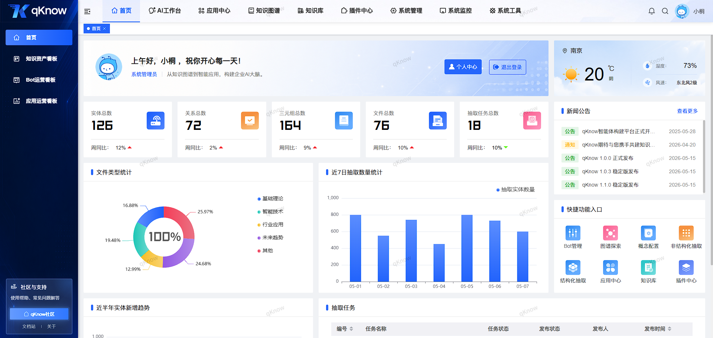</td>
    </tr>
    <tr>
        <td>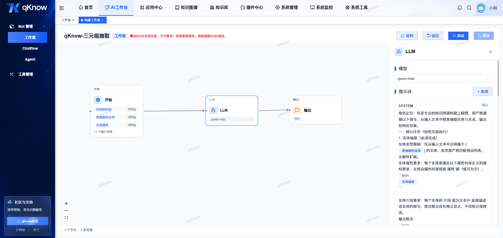</td>
        <td>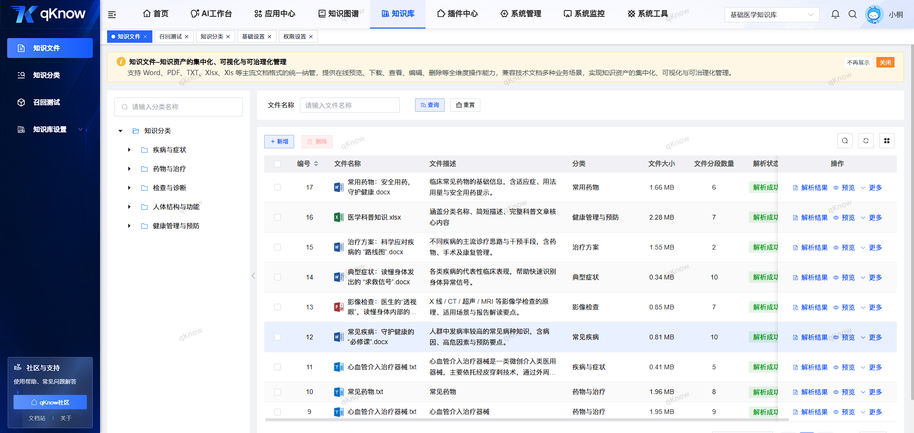</td>
    </tr>
    <tr>
        <td>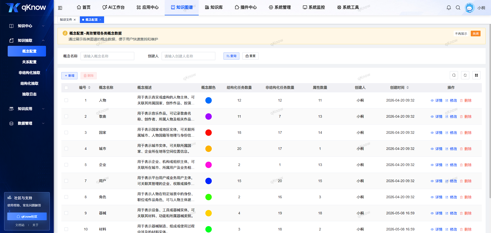</td>
        <td>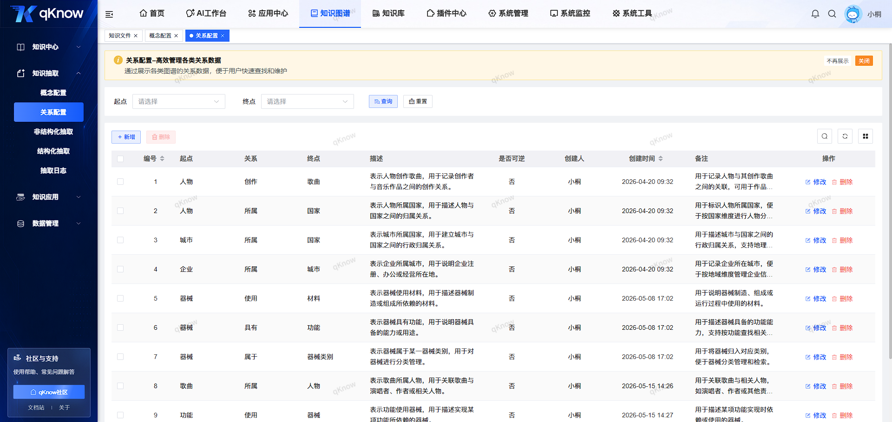</td>
    </tr>
    <tr>
        <td>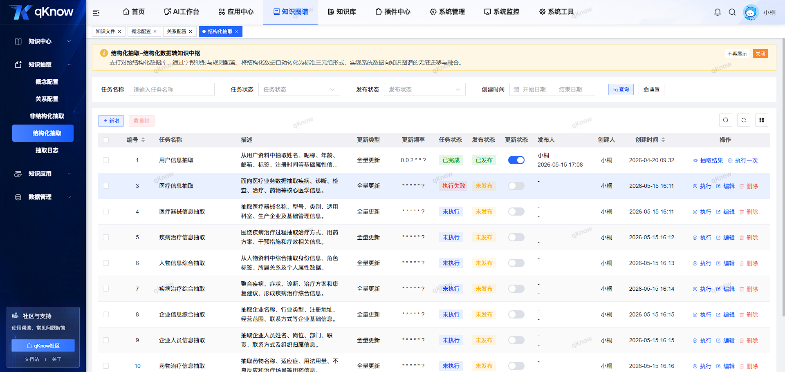</td>
        <td>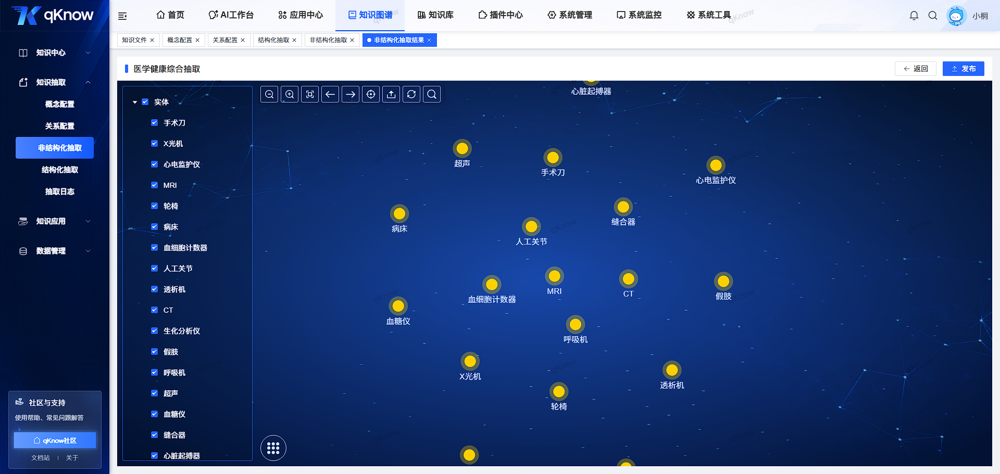</td>
    </tr>
    <tr>
        <td>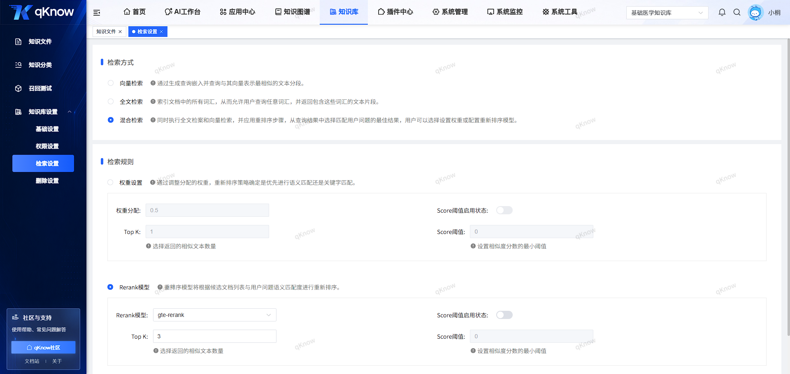</td>
        <td>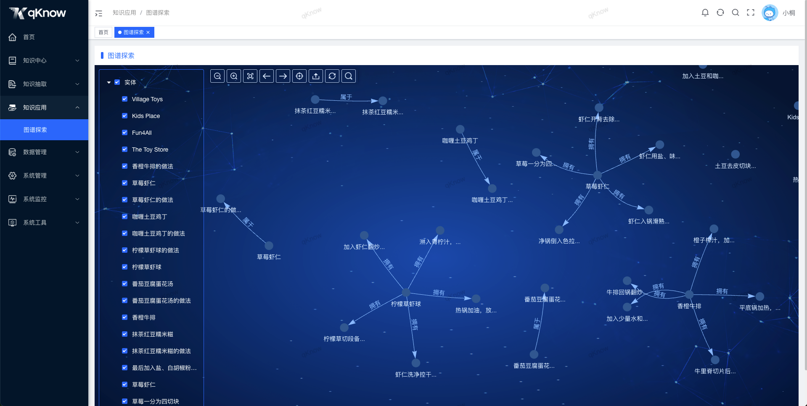</td>
    </tr>
</table>
