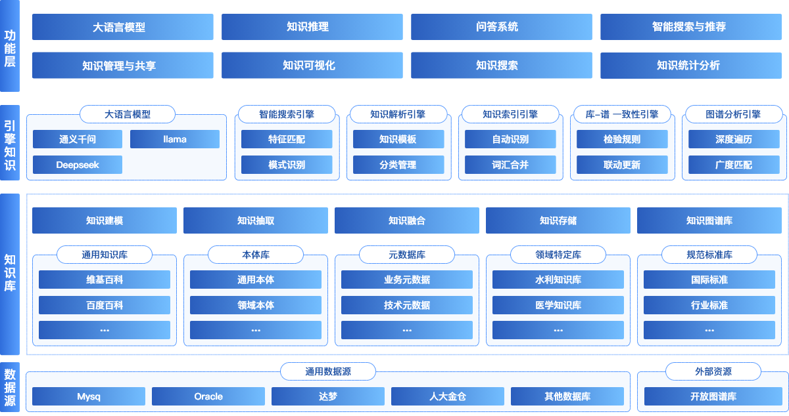

 
 
 
 
 
 
 

  📖简体中文 | <a href="README.en.md">📖English</a>

## 🌈平台简介
千知平台（qKnow） 是一款以**知识图谱**为核心的开源企业级知识平台，聚焦知识图谱的构建与应用，集成**知识抽取**、**知识融合**、**知识推理**等关键能力，支持从**结构化**与**非结构化**数据中高效获取和整合知识，帮助企业构建语义明确、动态演化的知识图谱体系。

平台为**智能问答**、**语义检索**和**智能体构建**提供坚实基础，是企业迈向智能化知识管理与AI融合应用的重要支撑平台。

✨✨✨**在线文档**✨✨✨ <a href="https://qknow.qiantong.tech" target="_blank">https://qknow.qiantong.tech</a>

✨✨✨**开源版演示地址**✨✨✨ <a href="https://qknow-demo.qiantong.tech" target="_blank">https://qknow-demo.qiantong.tech</a> ，账号：qKnow 密码：qKnow123

✨✨✨**商业版演示地址**✨✨✨ <a href="https://qknow-pro.qiantong.tech" target="_blank">https://qknow-pro.qiantong.tech</a> ，演示账号请联系客服获取

## 🍱 使用场景

**千知平台（qKnow）** 是一个基于知识图谱的知识管理平台，集成了大模型技术，适用于希望通过整合、治理和分析多源知识数据，打破信息孤岛、提升知识质量与利用效率，并实现智能化业务创新的企业和机构。无论是大型企业、中小企业，还是政府机构，均可通过该平台实现知识资产化与价值释放。

---

### 具体应用场景

| 场景           | 描述                                                        |
|--------------|-----------------------------------------------------------|
| **知识整合治理**   | 适用于任何需要整合来自不同来源的知识数据的企业或机构，如内部文档库、外部研究报告、社交媒体等。           |
| **提升知识质量效率** | 针对在知识管理和分析过程中遇到数据冗余、重复、不一致等问题的企业或机构，通过知识图谱和大模型进行清洗和标准化处理。 |
| **打破信息孤岛**   | 针对内部存在多个独立运行的知识系统，导致信息流通不畅的企业或机构，通过知识图谱实现跨系统的知识整合。        |
| **AI应用决策支持** | 通过知识图谱和大模型支持战略决策，深入挖掘知识价值，帮助企业制定更加精准的战略规划和决策。             |
| **推动数字化转型**  | 正在进行或计划进行数字化转型的企业和政府机构，无论其规模大小，都可以通过该平台实现知识驱动的数字化转型。      |

## 🚀 优势
- 知识图谱为骨，大模型为脑。
- 企业级架构，轻量级上手。
- 功能模块自由组合，扩展性强如拼乐高。
- 初生即开源，成长由社区共塑。
- 技术有温度，知识有脉络。

## ✨ 核心功能
| 功能模块   | 描述                                     | 状态     |
|--------|----------------------------------------|--------|
| 知识中心   | 提供文件分类与文件管理功能，帮助用户快速准确地找到所需资源。         | ✅ 已完成  |
| 概念配置   | 自定义知识抽取概念规则，提升信息提取的灵活性与准确性。            | ✅ 已完成  |
| 关系配置   | 灵活配置知识间关系抽取规则，强化知识关联建模能力。              | ✅ 已完成  |
| 非结构化抽取 | 基于DeepKE工具提取非结构化数据中的关键知识，提升信息利用率。      | ✅ 已完成  |
| 结构化抽取  | 从结构化数据源中系统化抽取、转换并加载结构化知识元素。            | ✅ 已完成  |
| 图谱探索   | 可视化、交互式知识图谱浏览与分析界面，助力深度洞察复杂关系网络。       | ✅ 已完成  |
| 系统管理   | 用户、角色、部门、菜单及日志等核心系统信息的统一管理和权限控制。       | ✅ 已完成  |
| 知识融合   | 融合多源异构知识，通过策略优化提升知识的一致性、准确性和可用性。       | ❌ 未来计划 |
| 知识推理   | 利用逻辑推理技术挖掘知识间的潜在关联，增强系统的语义理解和智能决策能力。   | ❌ 未来计划 |
| 知识问答   | 构建基于大语言模型（LLM）与知识图谱的智能问答系统，支持自然语言交互查询。 | ❌ 未来计划 |
| 知识检索   | 融合全文检索与语义理解技术，实现对知识库内容的高效精准检索。         | ❌ 未来计划 |
| 服务管理   | 服务注册、监控、维护与优化于一体的后台服务治理解决方案。           | ❌ 未来计划 |
| 服务日志   | 全面记录服务调用过程，支撑故障追踪与性能分析。                | ❌ 未来计划 |

## 🧩 架构图

## 🛠️ 技术栈
千知平台（qKnow）采用前后端分离架构，后端基于 Spring Boot，前端基于 Vue 3，整合常用中间件与数据工具，构建一站式数据中台解决方案。

<table>
  <tr>
    <th>技术栈</th><th>技术框架</th><th>描述</th>
  </tr>
  <tr>
    <td rowspan="6">后端技术栈</td><td>Spring Boot</td><td>主体框架，简化配置与开发</td>
  </tr>
  <tr>
    <td>MyBatis-Plus</td><td>ORM 框架，简化数据库操作</td>
  </tr>
  <tr>
    <td>Spring Framework</td><td>基础架构支持，包括依赖注入、面向切面编程等功能</td>
  </tr>
  <tr>
    <td>Quartz</td><td>定时任务调度</td>
  </tr>
  <tr>
    <td>Spring Security</td><td>安全框架，提供认证、授权等安全功能</td>
  </tr>
  <tr>
    <td>Alibaba Druid</td><td>数据库连接池，优化数据库访问性能</td>
  </tr>

  <tr>
    <td rowspan="8">前端技术栈</td><td>Vue 3</td><td>渐进式前端框架</td>
  </tr>
  <tr>
    <td>Vite</td><td>快速构建工具，替代 Vue CLI</td>
  </tr>
  <tr>
    <td>Element Plus</td><td>UI 组件库</td>
  </tr>
  <tr>
    <td>Axios</td><td>HTTP 请求库</td>
  </tr>
  <tr>
    <td>Pinia</td><td>状态管理（替代 Vuex）</td>
  </tr>
  <tr>
    <td>Vue Router</td><td>前端路由控制</td>
  </tr>
  <tr>
    <td>Vis</td><td>知识图谱展示，创建动态、交互式的可视化图表和网络图</td>
  </tr>
  <tr>
    <td>Echarts</td><td>数据可视化库，支持多种类型的图表</td>
  </tr>
  

  <tr>
    <td rowspan="6">第三方依赖</td><td>DeepKE</td><td>知识抽取工具，利用深度学习技术从文本中提取实体关系</td>
  </tr>
  <tr>
    <td>MySQL</td><td>核心关系型数据库</td>
  </tr>
  <tr>
    <td>Neo4j</td><td>图数据库</td>
  </tr>
  <tr>
    <td>Redis</td><td>数据缓存与高性能数据读取</td>
  </tr>
  <tr>
    <td>Swagger</td><td>接口文档生成工具</td>
  </tr>
  <tr>
    <td>Docker（可选）</td><td>容器化部署支持</td>
  </tr>
</table>

## 🏗️ 部署要求
在部署 qKnow 之前，请确保以下环境和工具已正确安装：

<table>
  <tr>
    <th>环境</th><th>项目</th><th>推荐版本</th><th>说明</th>
  </tr>
  <tr>
    <td rowspan="6">后端</td><td>JDK</td><td>1.8 或以上</td><td>建议使用 OpenJDK 8 或 11</td>
  </tr>
  <tr>
    <td>Maven</td><td>3.6+</td><td>项目构建与依赖管理</td>
  </tr>
  <tr>
    <td>MySQL</td><td>5.7 或 8.0</td><td>关系型数据库</td>
  </tr>
  <tr>
    <td>Neo4j</td><td>4.4.40</td><td>图数据库</td>
  </tr>
  <tr>
    <td>Redis</td><td>5.0+</td><td>缓存与消息功能支持</td>
  </tr>
  <tr>
    <td>操作系统</td><td>Windows / Linux / Mac</td><td>通用环境均可运行</td>
  </tr>

  <tr>
    <td rowspan="3">前端</td><td>Node.js</td><td>16+</td><td>构建工具依赖</td>
  </tr>
  <tr>
    <td>npm / pnpm / yarn</td><td>任一即可</td><td>包管理器</td>
  </tr>
  <tr>
    <td>Vue CLI / Vite</td><td>最新版</td><td>脚手架工具</td>
  </tr>
</table>

## 🚨 商用授权

👉 如需在商业场景中使用千知平台，请点击下方按钮查看商用授权详情：

[💼 了解授权详情](https://qknow.qiantong.tech/business.html)

## 🚀 快速开始
👉 点击下方按钮，查看完整的安装与部署指南：

[🧭 查看快速开始文档](QUICKSTART.md)

## 👥 QQ交流群
欢迎加入 千知平台（qKnow） 官方 QQ 交流群，获取最新动态、技术支持与使用交流。

## 🖼️ 系统配图
<table>
    <tr>
        <td></td>
        <td></td>
    </tr>
    <tr>
        <td></td>
        <td></td>
    </tr>
    <tr>
        <td></td>
        <td></td>
    </tr>
    <tr>
        <td></td>
        <td></td>
    </tr>
    <tr>
        <td></td>
        <td></td>
    </tr>
</table>
