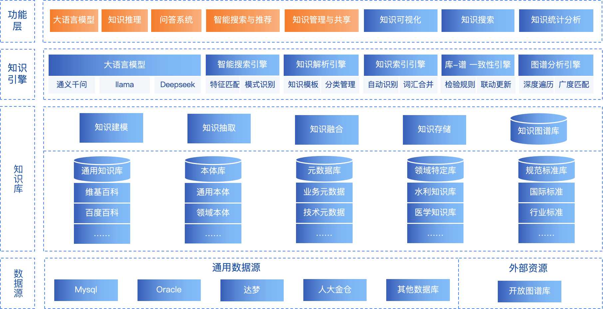
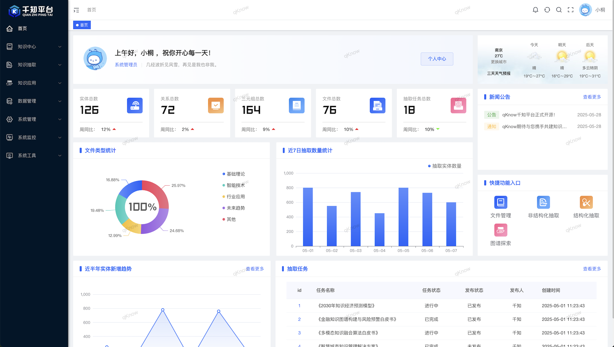
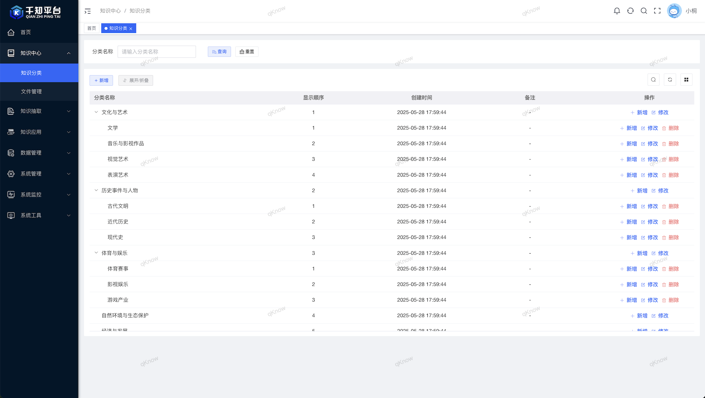
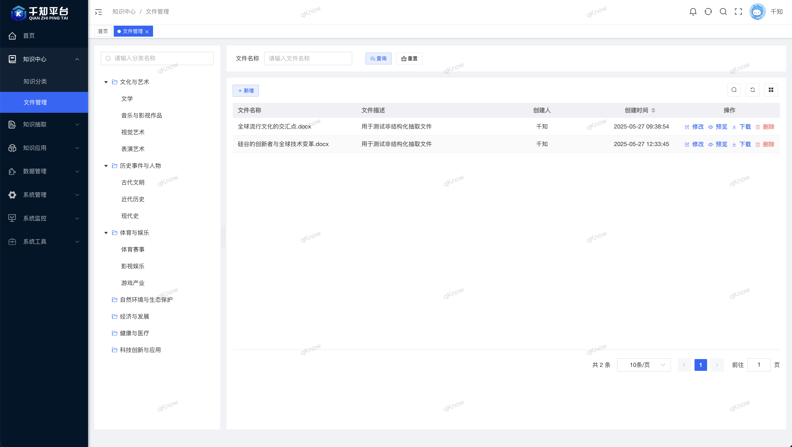
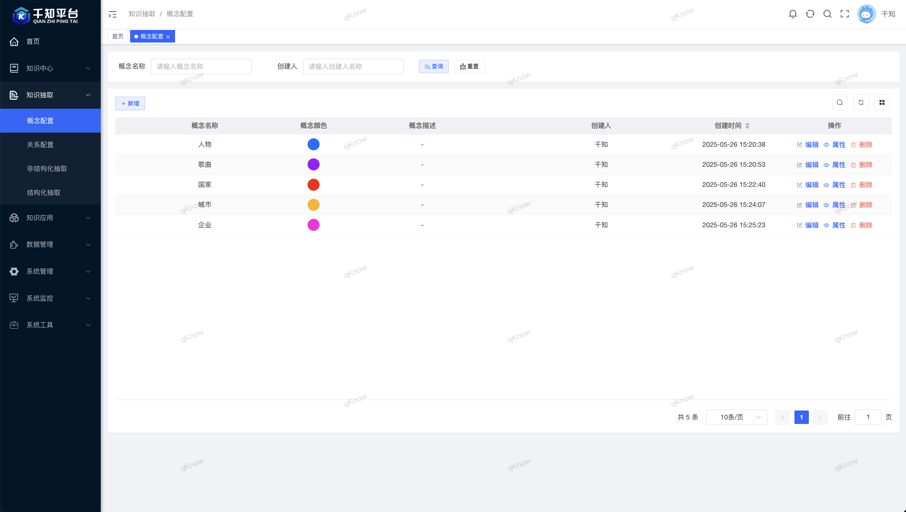
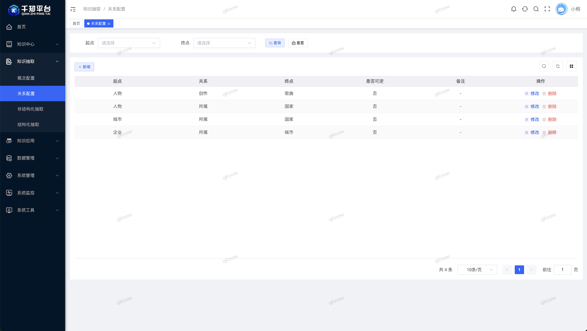
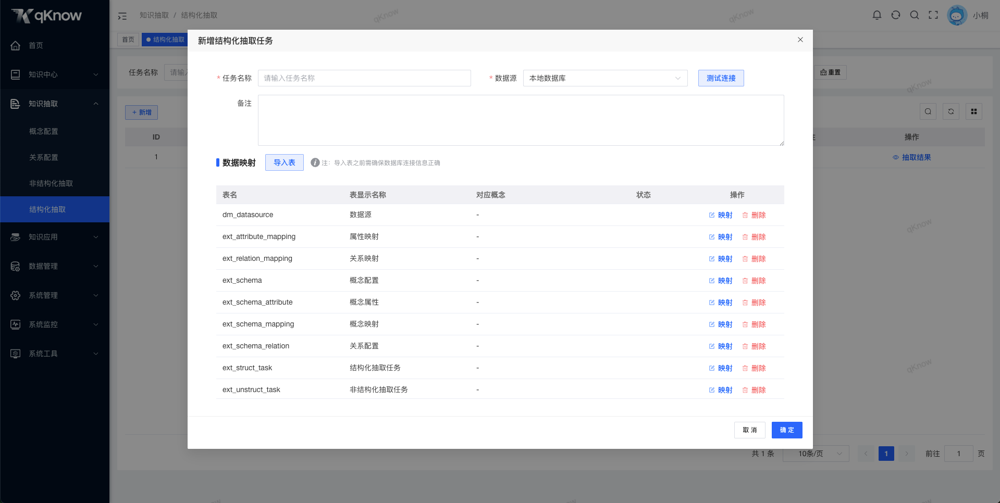
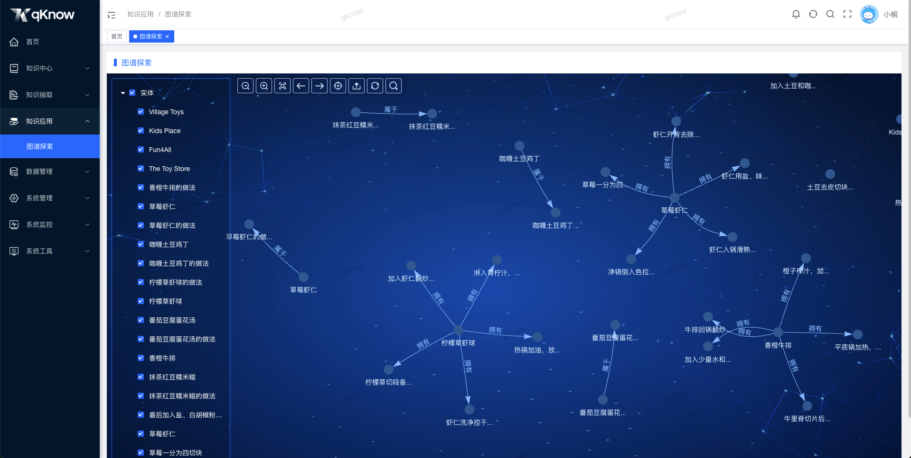

 
 
 
 
 
 
 

  📖简体中文 | <a href="README.en.md">📖English</a>

## 🌈平台简介
**千知平台（qKnow）**是一款**面向企业级应用**的开源知识管理系统，深度融合**知识抽取**、**知识融合**、**知识推理**与**知识图谱**构建等核心能力。平台集成先进的**大语言模型（LLM）技术**，显著提升对结构化、非结构化数据的理解与处理能力，实现更智能、高效的**知识提取**与**语义融合**。借助大模型强大的推理与表达能力，千知平台可帮助企事业单位快速构建高质量、可落地的**知识图谱体系**，驱动**智能化决策**与**业务创新**。

<!--  ✨✨✨**演示地址**✨✨✨ [**点击跳转**](https://gitee.com/qiantongtech/qKnow) -->

## 🍱 使用场景
- 企业内部知识管理：技术文档库、员工手册、项目文档等。
- 客户服务支持：在线客服、帮助中心、FAQ等。
- 决策支持与战略规划：行业分析报告、竞争对手情报、市场需求预测等。
- 教育与培训：在线课程、职业培训、技能提升等。
- 故障诊断与维护：IT系统运维、生产设备维护、车辆维修等。
- 法规遵从与风险管理：合同审查、政策更新、风险评估等。

## 🚀 优势
- 知识图谱为骨，大模型为脑。
- 企业级架构，轻量级上手。
- 功能模块自由组合，扩展性强如拼乐高。
- 初生即开源，成长由社区共塑。
- 技术有温度，知识有脉络。

## ✨ 核心功能
| 功能模块   | 描述                                     | 状态     |
|--------|----------------------------------------|--------|
| 知识中心   | 体系化知识分类与高效文件管理，助力用户精准快速定位所需资源。         | ✅ 已完成  |
| 概念配置   | 自定义知识抽取概念规则，提升信息提取的灵活性与准确性。            | ✅ 已完成  |
| 关系配置   | 灵活配置知识间关系抽取规则，强化知识关联建模能力。              | ✅ 已完成  |
| 非结构化抽取 | 基于预训练模型高效提取非结构化数据中的关键知识，提升信息利用率。       | ✅ 已完成  |
| 结构化抽取  | 从结构化数据源中系统化抽取、转换并加载结构化知识元素。            | ✅ 已完成  |
| 图谱探索   | 可视化、交互式知识图谱浏览与分析界面，助力深度洞察复杂关系网络。       | ✅ 已完成  |
| 系统管理   | 用户、角色、部门、菜单及日志等核心系统信息的统一管理和权限控制。       | ✅ 已完成  |
| 知识融合   | 融合多源异构知识，通过策略优化提升知识的一致性、准确性和可用性。       | ❌ 未来计划 |
| 知识推理   | 利用逻辑推理技术挖掘知识间的潜在关联，增强系统的语义理解和智能决策能力。   | ❌ 未来计划 |
| 知识问答   | 构建基于大语言模型（LLM）与知识图谱的智能问答系统，支持自然语言交互查询。 | ❌ 未来计划 |
| 知识检索   | 融合全文检索与语义理解技术，实现对知识库内容的高效精准检索。         | ❌ 未来计划 |
| 服务管理   | 服务注册、监控、维护与优化于一体的后台服务治理解决方案。           | ❌ 未来计划 |
| 服务日志   | 全面记录服务调用过程，支撑故障追踪与性能分析。                | ❌ 未来计划 |

## 🚨 默认端口

| 端口号  | 协议   | 说明         |
|------|------|------------|
| 8090 | http | 服务端        |
| 80   | http | 网页端        |
| 7687 | http | Neo4j数据库   |
| 7474 | http | Neo4j可视化面板 |
| 3306 | http | mysql数据库   |
| 6379 | http | Redis      |

**访问地址**：127.0.0.1:80 端口同上，账号：qKnow 密码：qKnow123

## 🧩 架构图

## 🛠️ 技术栈
千知平台（qKnow）采用前后端分离架构，后端基于 Spring Boot，前端基于 Vue 3，整合常用中间件与数据工具，构建一站式数据中台解决方案。

### 🖥️ 后端技术栈

| 技术框架             | 描述                      |
|------------------|-------------------------|
| Spring Boot      | 主体框架，简化配置与开发            |
| MyBatis-Plus     | ORM 框架，简化数据库操作          |
| Spring Framework | 基础架构支持，包括依赖注入、面向切面编程等功能 |
| Quartz           | 定时任务调度                  |
| Spring Security  | 安全框架，提供认证、授权等安全功能       |
| Alibaba Druid    | 数据库连接池，优化数据库访问性能        |

### 🌐 前端技术栈

| 技术框架         | 描述                        |
|--------------|---------------------------|
| Vue 3        | 渐进式前端框架                   |
| Vite         | 快速构建工具，替代 Vue CLI         |
| Element Plus | UI 组件库                    |
| Axios        | HTTP 请求库                  |
| Pinia        | 状态管理（替代 Vuex）             |
| Vue Router   | 前端路由控制                    |
| Vis          | 知识图谱展示，创建动态、交互式的可视化图表和网络图 |
| Echarts      | 数据可视化库，支持多种类型的图表          |

### 🧩 通用组件 & 第三方依赖

| 组件 / 工具                                        | 描述                        |
|------------------------------------------------|---------------------------|
| [**DeepKE**](https://github.com/zjunlp/DeepKE) | 知识抽取工具，利用深度学习技术从文本中提取实体关系 |
| MySQL                                          | 核心关系型数据库                  |
| Neo4j                                          | 图数据库                      |
| Redis                                          | 数据缓存与高性能数据读取              |
| Swagger                                        | 接口文档生成工具                  |
| Docker（可选）                                     | 容器化部署支持                   |

## 🏗️ 部署要求
在部署 qKnow 之前，请确保以下环境和工具已正确安装：

### 🖥️ 服务端环境要求（后端）

| 项目    | 推荐版本                  | 说明                  |
|-------|-----------------------|---------------------|
| JDK   | 1.8 或以上               | 建议使用 OpenJDK 8 或 11 |
| Maven | 3.6+                  | 项目构建与依赖管理           |
| MySQL | 5.7 或 8.0             | 关系型数据库              |
| Neo4j | 4.4.40                | 图数据库                |
| Redis | 5.0+                  | 缓存与消息功能支持           |
| 操作系统  | Windows / Linux / Mac | 通用环境均可运行            |

### 🌐 前端环境要求（可选，若需本地构建）

| 项目                | 推荐版本 | 说明     |
|-------------------|------|--------|
| Node.js           | 16+  | 构建工具依赖 |
| npm / pnpm / yarn | 任一即可 | 包管理器   |
| Vue CLI / Vite    | 最新版  | 脚手架工具  |

## 🚨 商用授权
> **版权申明**：
> - 产品的迭代更新需要大家支持，在第三方获取到的商业版本源码，没有可靠性且未经授权，由此带来的法律后果自行承担。
> - 授权用户不能直接销售和分发 **千知平台（qKnow）** 商业版源码。
> - 授权用户二次开发和修改部分的源码可以申请软件著作权，不可以申请 **千知平台（qKnow）** 源码部分的软件著作权。

| 系统版本 | 开源版本                                   | 商业版本                                   |
|------|----------------------------------------|----------------------------------------|
| 许可协议 | 基于Apache License 2.0并附带一些额外限制          | 永久授权                                   |
| 系统用途 | 非商业用途，仅用于个人学习和使用                       | 商业用途，包含所有源码和文档，购买后提供发票/合同和授权书          |
| 系统功能 | 知识中心、概念配置、关系配置、非结构化抽取、结构化抽取、图谱探索、系统管理等 | 开源版所有功能、知识融合、知识推理、知识问答、知识检索、服务管理、服务日志等 |
| 授权费用 | 免费，可商用（注意额外限制）                         | 10万元                                   |
| 相关服务 | 定期更新                                   | 加入商业版私有仓库，赠送一年的订阅更新                    |
| 技术支持 | QQ群交流                                  | 企业用户群交流，提供必要技术支持                       |
| 代码更新 | Gitee、Github更新                         | Git私服更新                                |

## 🚀 快速开始
👉 点击下方按钮，查看完整的安装与部署指南：

[🧭 查看快速开始文档](QUICKSTART.md)

## 👥 QQ交流群
欢迎加入 千知平台（qKnow） 官方 QQ 交流群，获取最新动态、技术支持与使用交流。

## 🖼️ 系统配图
<table>
    <tr>
        <td></td>
        <td></td>
    </tr>
    <tr>
        <td></td>
        <td></td>
    </tr>
    <tr>
        <td></td>
        <td></td>
    </tr>
    <tr>
        <td></td>
        <td></td>
    </tr>
    <tr>
        <td></td>
        <td></td>
    </tr>
</table>
