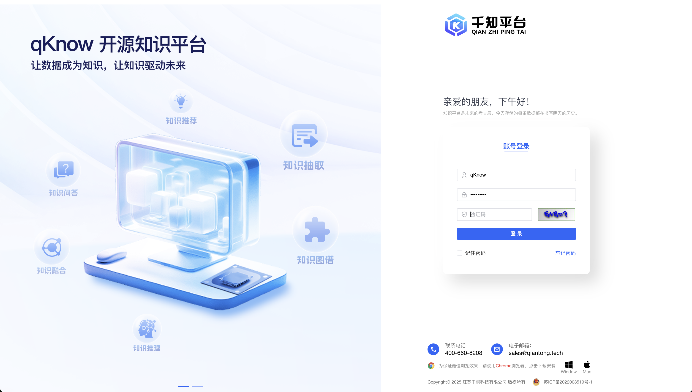
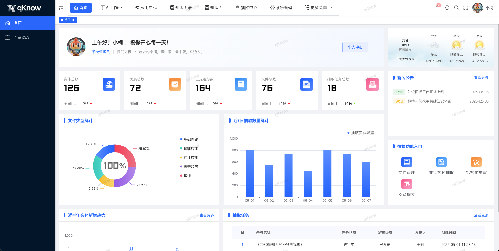
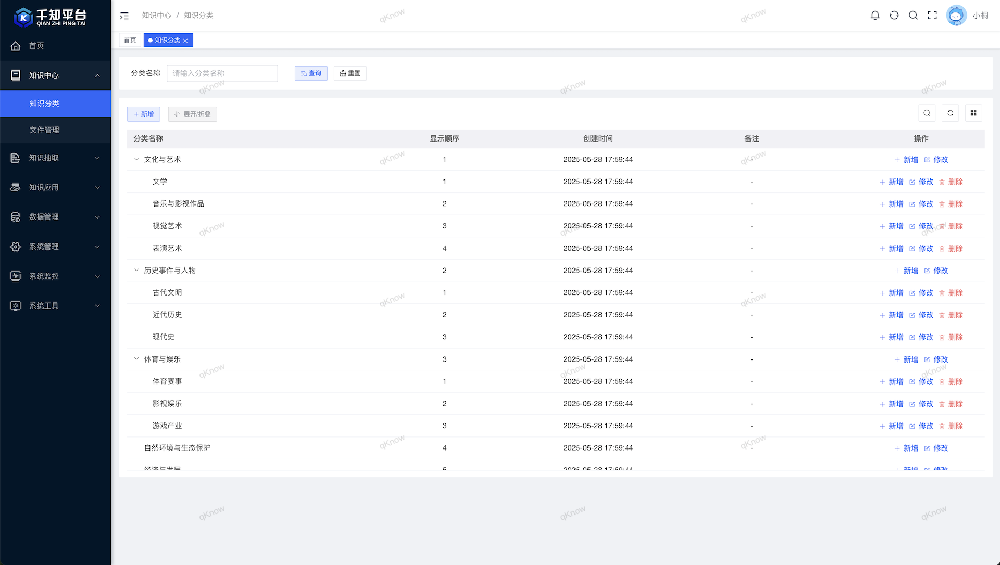
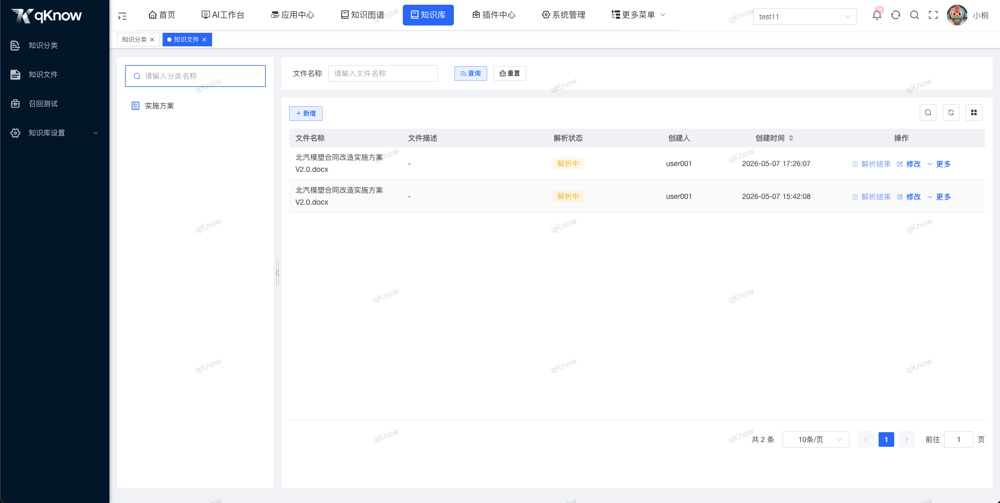
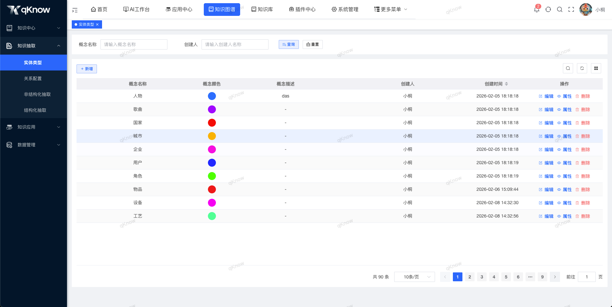
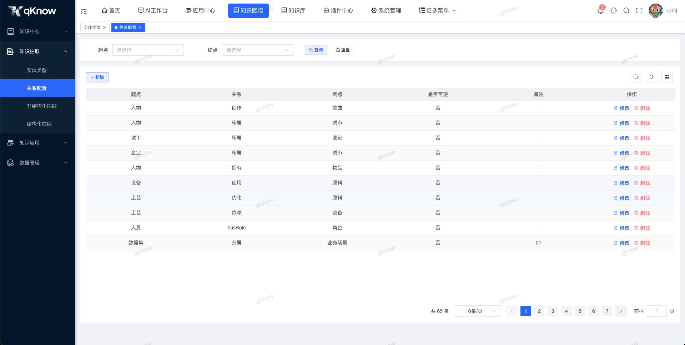
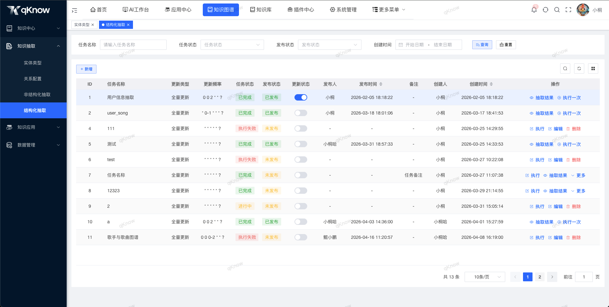
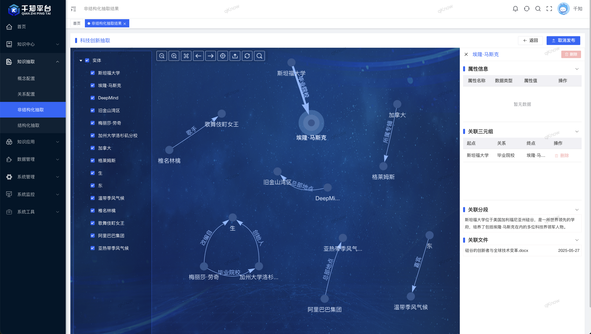
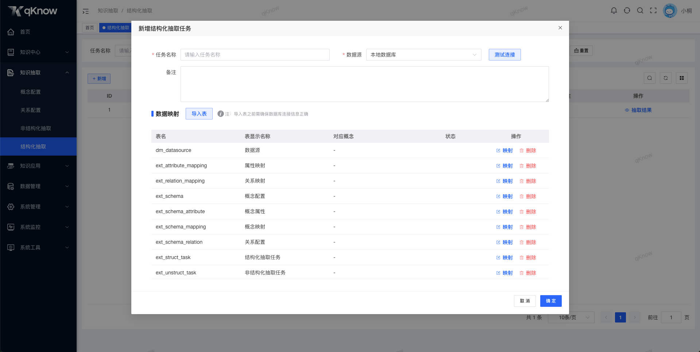
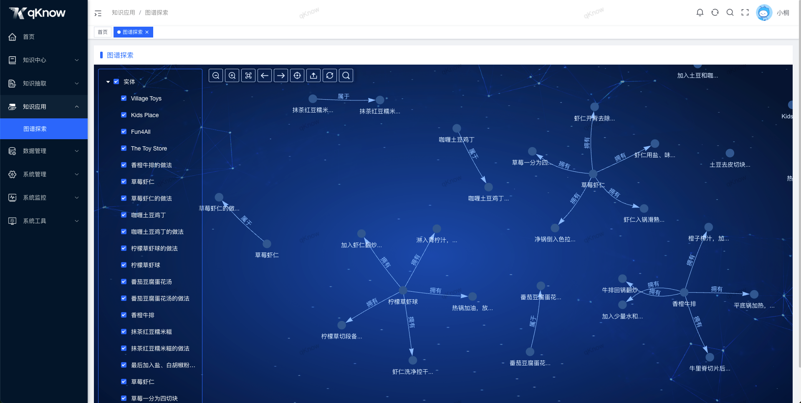

 
 
 
 
 
 
 

  <strong>qKnow：面向企业级行业深度场景的 AI 智能体构建平台与解决方案孵化平台。</strong>

  📖简体中文 | <a href="README.en.md">📖English</a>

---

## 🌈平台简介

**qKnow** 是一个面向企业与行业场景的开源智能体构建平台，提供知识图谱、知识库 RAG、模型接入、Bot 构建与智能问答应用等能力，帮助企业将分散知识转化为 AI 可理解、可调用、可复用的能力资产。 

平台支持基于企业文档、结构化数据和业务知识构建专业知识中枢，并通过可视化编排快速生成业务智能体，为知识问答、流程自动化和智能检索等场景提供支撑。

✨✨✨**在线文档**✨✨✨ <a href="https://qknow.qiantong.tech" target="_blank">https://qknow.qiantong.tech</a>

✨✨✨**演示地址**✨✨✨ <a href="https://qknow-demo.qiantong.tech" target="_blank">https://qknow-demo.qiantong.tech</a> （账号：`qKnow`，密码：`qKnow123`）

---

## 🎯 qKnow 能帮你解决哪些场景？

你可以使用 qKnow 快速构建：

- 企业知识库问答助手
- 行业专家智能体
- 内部制度 / 标准 / 手册问答系统
- 知识图谱驱动的可解释智能检索应用
- 面向业务流程的 AI Bot 与智能应用
- 面向行业场景的知识中枢与智能分析平台

---

## ✨ 为什么选择 qKnow？

| 能力亮点              | 说明                                                       |
|-------------------|----------------------------------------------------------|
| 🧠 知识图谱 + RAG 双引擎 | 同时支持结构化知识建模与非结构化文档检索，兼顾语义召回、关系推理与结果可追溯。                  |
| 🤖 面向企业的 Agent 构建 | 支持 Bot 创建、调试、发布与应用配置，帮助企业快速搭建可落地的业务智能体。                  |
| 🧩 可视化编排          | 通过拖拽式画布编排 Workflow、Chatflow 与 Agent，降低复杂 AI 应用构建门槛。      |
| 📚 企业知识资产沉淀       | 支持文档、结构化数据、概念、关系、实体、三元组等知识资产统一管理。                        |
| 🔌 开放模型接入         | 基于 Spring AI 接入大模型能力，便于适配不同模型服务与企业内部模型环境。                |
| 🏗️ 插件化应用扩展       | 基于统一应用插件架构，支持知识问答及后续更多智能应用持续接入。                          |
| ☕ Java 技术栈友好      | 后端采用 JDK 17 + Spring Boot 3，适合 Java 技术团队二次开发、私有化部署与企业集成。 |

---

## 🍱 典型应用场景

| 场景                | 说明                                   |
|-------------------|--------------------------------------|
| **企业智能体构建**       | 快速构建知识问答、流程自动化、专家助手、智能客服等业务 Bot。     |
| **企业知识智能化治理**     | 将文档、数据库、业务系统和专家经验统一沉淀为可复用知识资产。       |
| **知识图谱增强应用**      | 基于实体、关系、事件和规则构建可解释、可追溯的业务知识网络。       |
| **知识库 RAG 问答与检索** | 面向制度、标准、手册、报告、案例等资料提供精准检索、增强生成与引用溯源。 |
| **企业深度AI应用扩展**    | 以内置智能问答应用为起点，基于统一插件架构支撑后续智能应用持续接入。   |

---

## 🚀 核心优势

- **知识驱动智能体构建**：通过知识图谱与知识库 RAG，让智能体更好理解企业知识与业务语境。
- **可视化编排构建**：支持通过拖拽画布编排 Workflow、Chatflow 与 Agent，降低智能体构建门槛。
- **Bot 构建与应用配置一体化**：从智能体创建、调试、发布到应用配置，形成完整使用链路。
- **开放兼容的大模型底座**：基于 Spring AI 接入大模型能力，支持灵活适配不同模型服务。
- **插件化应用持续扩展**：基于统一应用插件开发架构，支持后续智能应用按标准方式接入平台。

---

## ✨ 核心功能
| 功能模块    | 描述                                                  |
|---------|-----------------------------------------------------|
| 模型接入    | 支持统一配置和管理大模型服务，基于 Spring AI 接入不同模型厂商，为智能体和应用提供模型能力。 |
| Bot 管理  | 支持智能体的创建、编辑、复制、发布、调试和运行状态管理。                        |
| 可视化编排中心 | 支持通过拖拽式画布编排 Workflow、Chatflow 与 Agent，快速构建业务智能体。    |
| 资产中心    | 支持统一管理工具、插件、提示词、知识组件和可复用智能体资产。                      |
| 应用中心    | 支持集中展示、访问和管理平台内置应用及用户自建应用。                          |
| 应用配置    | 支持为应用绑定知识库、知识图谱、Bot 和参数配置，生成专属应用。                   |
| 知识问答    | 基于统一的应用插件开发架构，支持知识问答及后续各类智能应用以插件化方式标准接入、独立扩展和统一管理。  |
| 知识中心    | 支持文档、资料和知识资产的分类管理，帮助用户统一沉淀和组织企业知识。                  |
| 概念配置    | 支持自定义实体、概念及抽取规则，为知识图谱构建提供标准化概念体系。                   |
| 关系配置    | 支持配置概念之间的关系类型与抽取规则，增强知识之间的关联建模能力。                   |
| 非结构化抽取  | 支持从文档、文本等非结构化内容中自动抽取实体、关系和三元组。                      |
| 结构化抽取   | 支持从数据库、表格等结构化数据源中抽取知识元素并构建图谱数据。                     |
| 图谱可视化   | 支持知识图谱的可视化浏览、关系追踪、智能检索和交互式分析。                       |
| 知识库管理   | 支持知识库创建、配置、更新与管理，为 RAG 问答和语义检索提供知识支撑。               |
| 文件解析    | 支持多格式文件解析、文本清洗、内容切分和语义片段生成。                         |
| 召回测试    | 支持模拟用户问题测试知识片段召回效果，并辅助优化检索参数。                       |

> 注：核心功能将随版本持续迭代，更多智能应用、行业插件与知识增强能力将基于统一插件架构逐步接入，欢迎社区参与共建。

---

## 🛠️ 技术栈

qKnow 采用前后端分离架构，后端基于 Spring Boot 3 与 JDK 17，前端基于 Vue 3，并通过 Spring AI 接入大模型能力。

<table>
  <tr>
    <th>技术栈</th><th>技术框架</th><th>描述</th>
  </tr>
  <tr>
    <td rowspan="8">后端技术栈</td><td>JDK 17</td><td>后端运行环境</td>
  </tr>
  <tr>
    <td>Spring Boot 3</td><td>后端主体框架，简化配置与开发</td>
  </tr>
  <tr>
    <td>Spring AI</td><td>大模型接入与 AI 能力集成框架</td>
  </tr>
  <tr>   
    <td>MyBatis-Plus</td><td>ORM 框架，简化数据库操作</td>
  </tr>
  <tr>
    <td>Spring Framework</td><td>基础架构支持，包括依赖注入、面向切面编程等能力</td>
  </tr>
  <tr>
    <td>Quartz</td><td>定时任务调度</td>
  </tr>
  <tr>
    <td>Spring Security</td><td>认证、授权与安全控制</td>
  </tr>
  <tr>
    <td>Alibaba Druid</td><td>数据库连接池，优化数据库访问性能</td>
  </tr>

  <tr>
    <td rowspan="8">前端技术栈</td><td>Vue 3</td><td>渐进式前端框架</td>
  </tr>
  <tr>
    <td>Vite</td><td>快速构建工具</td>
  </tr>
  <tr>
    <td>Element Plus</td><td>UI 组件库</td>
  </tr>
  <tr>
    <td>Axios</td><td>HTTP 请求库</td>
  </tr>
  <tr>
    <td>Pinia</td><td>前端状态管理</td>
  </tr>
  <tr>
    <td>Vue Router</td><td>前端路由控制</td>
  </tr>
  <tr>
    <td>Vis</td><td>知识图谱展示与网络图可视化</td>
  </tr>
  <tr>
    <td>ECharts</td><td>数据可视化库，支持多种图表展示</td>
  </tr>

  <tr>
    <td rowspan="6">第三方依赖</td><td>MySQL 5.7</td><td>关系型数据库</td>
  </tr>
  <tr>
    <td>Neo4j 4.4.40</td><td>图数据库，用于知识图谱存储与查询</td>
  </tr>
  <tr>
    <td>Weaviate</td><td>向量数据库，用于知识库向量存储与语义检索</td>
  </tr>
  <tr>
    <td>Redis</td><td>缓存与高性能数据读取</td>
  </tr>
  <tr>
    <td>Swagger / OpenAPI</td><td>接口文档生成与调试工具</td>
  </tr>
  <tr>
    <td>Docker（可选）</td><td>容器化部署支持</td>
  </tr>
</table>

---

## 🏗️ 部署要求
在部署 qKnow 之前，请确保以下环境和工具已正确安装：

<table>
  <tr>
    <th>环境</th><th>项目</th><th>推荐版本</th><th>说明</th>
  </tr>
  <tr>
    <td rowspan="7">后端</td><td>JDK</td><td>17+</td><td>建议使用 OpenJDK 17</td>
  </tr>
  <tr>
    <td>Maven</td><td>3.8+</td><td>项目构建与依赖管理</td>
  </tr>
  <tr>
    <td>MySQL</td><td>5.7</td><td>关系型数据库</td>
  </tr>
  <tr>
    <td>Neo4j</td><td>4.4.40</td><td>图数据库</td>
  </tr>
  <tr>
    <td>Weaviate</td><td>建议使用稳定版本</td><td>向量数据库</td>
  </tr>
  <tr>
    <td>Redis</td><td>5.0+</td><td>缓存与消息功能支持</td>
  </tr>
  <tr>
    <td>操作系统</td><td>Windows / Linux / Mac</td><td>通用环境均可运行</td>
  </tr>

  <tr>
    <td rowspan="3">前端</td><td>Node.js</td><td>16+</td><td>构建工具依赖</td>
  </tr>
  <tr>
    <td>npm / pnpm / yarn</td><td>任一即可</td><td>包管理器</td>
  </tr>
  <tr>
    <td>Vue 3 / Vite</td><td>3.x / 最新稳定版</td><td>前端开发与构建工具</td>
  </tr>
</table>

---

## 🚨 商用授权

qKnow 提供 **专业版** 与 **开源版** 两种形态，满足不同规模与场景下的用户需求。两者既各具特色，又形成互补：开源版更像启蒙老师，帮助低成本起步；专业版更像专家顾问，提供深度与保障。无论选择哪种版本，qKnow 都将成为可靠的伙伴，帮助企业迈向智能化知识管理与 AI 融合应用。

👉 如需 **开源版品牌定制授权** 或 **咨询专业版**，请点击按钮查看详情：[💼 了解授权详情](https://qknow.qiantong.tech/business.html)

---

## 🚀 快速开始

| 部署方式                                                                                        | 说明                                                                       | 适用场景                   |
|---------------------------------------------------------------------------------------------|--------------------------------------------------------------------------|------------------------|
| [Docker Compose 部署](https://qknow.qiantong.tech/docs/deploy/docker-compose-deployment.html) | 所有组件（DeepKE、Neo4j、Mysql、Nginx、Redis 等）以及 qKnow 源码都通过 Docker Compose 一键启动 | **初学者快速上手**、功能演示、测试环境  |
| [自主部署（纯手工安装）](https://qknow.qiantong.tech/docs/deploy/manual-deployment/)                   | 所有依赖组件及 qKnow 服务均需手工安装和配置                                                | **生产环境**、大规模部署、个性化定制场景 |

> 首次体验推荐使用 Docker Compose 部署方式，可以更快完成环境启动和功能验证。

---

## 👥 交流与反馈

欢迎加入 qKnow 官方 QQ 交流群，获取平台最新动态、部署支持和社区交流。

👉 [点击加入 QQ 交流群](https://qknow.qiantong.tech/discuss.html)

你也可以通过 Issue 反馈问题、提交建议或参与项目共建。

---

## 🤝 参与共建

qKnow 欢迎开发者、企业用户和行业伙伴共同参与建设。

你可以通过以下方式参与：

- 提交 Issue，反馈问题或提出建议
- 提交 Pull Request，参与代码贡献
- 完善文档、示例和部署教程
- 分享基于 qKnow 的行业应用实践
- 参与知识图谱、RAG、Agent、插件生态等方向共建

---

## 🖼️ 系统配图
<table>
    <tr>
        <td></td>
        <td></td>
    </tr>
    <tr>
        <td></td>
        <td></td>
    </tr>
    <tr>
        <td></td>
        <td></td>
    </tr>
    <tr>
        <td></td>
        <td></td>
    </tr>
    <tr>
        <td></td>
        <td></td>
    </tr>
</table>
